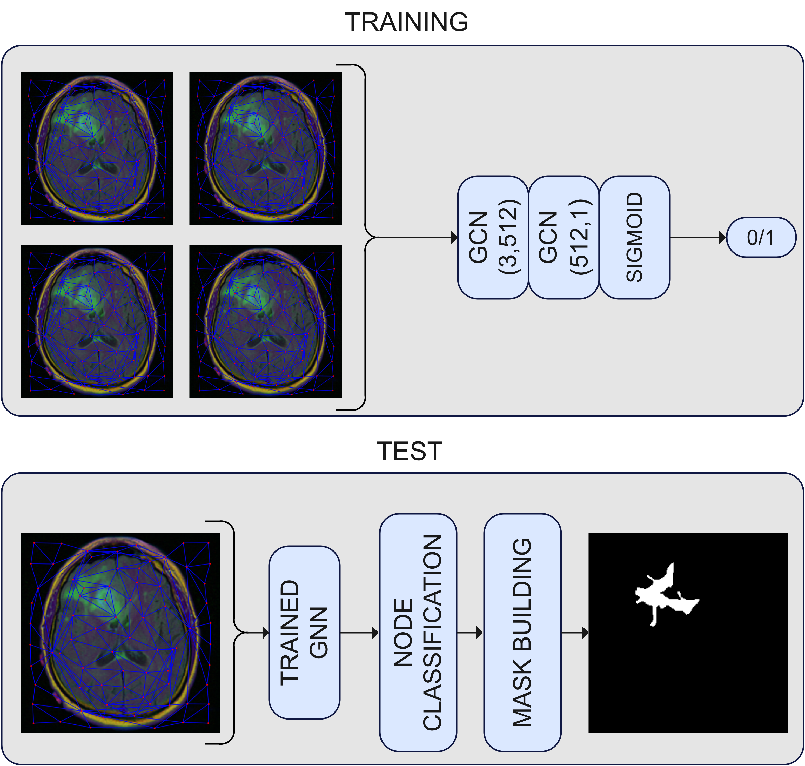

# Glioma-Segmentation-Using-GNN
This repository provides a new graph-based deep-learning approach for glioma segmentation. It is based on constructing a graph starting from an MRI scan and then employing a Graph Neural Network.

## Dataset
The dataset used for our experimental activity is publicly available at: [https://www.kaggle.com/datasets/mateuszbuda/lgg-mri-segmentation]()
It contains MRI scans of 110 patients with lower-grade glioma with the relative segmentation mask annotated by medical personnel. 

## Graph Construction
Given an MRI scan and its mask, the steps for the graph building are:
- segmentation of the image into superpixels using the Felzenszwalb algorithm;
- computation of the superpixel features averaging all the pixels within each superpixel.
- construction of a Region Adiacenjy Graph. The nodes are the superpixels; the edges are the spatial relationships between them. 


## Glioma segmentation
First, we build graphs from MRI images and the related masks, as previously described. We use these graphs to train a very simple GNN, including two GCN layers with a dimensionality of 512 and a final layer with one unit with a Sigmoid activation function to perform the final node classification. We perform Batch Normalization and Dropout between the GCN layers to enhance model generalization and mitigate overfitting.After training the GNN, we perform node classification and build the final segmentation mask. 




## Installation

To install the required dependencies, use:

```bash
pip install -r requirements.txt
```
